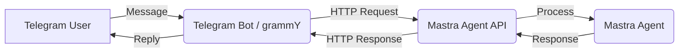

Okay, let's create a guide on building a Telegram bot that acts as a proxy to a Mastra AI agent. We'll use `grammY` for the Telegram bot framework as it's a popular and robust choice in the TypeScript ecosystem, similar to Mastra.

---

## Guide: Creating a Telegram Bot Proxy for a Mastra Agent

This guide will walk you through setting up a Telegram bot that forwards user messages to a Mastra AI agent and sends the agent's response back to the Telegram chat.

**Goal:** Build a system where users interact with a Telegram bot, but the core intelligence comes from a Mastra agent running separately.

**Architecture:**

1.  **Mastra Backend:** Hosts your Mastra agent(s) and exposes them via an HTTP API (using `mastra dev` locally or a deployed Mastra server).
2.  **Telegram Bot (Proxy):** A separate Node.js application using `grammY` that listens for Telegram updates, calls the Mastra agent API, and relays messages.



---

### Prerequisites

1.  **Node.js:** Version 20.0 or higher installed.
2.  **Package Manager:** npm, yarn, or pnpm.
3.  **Mastra CLI:** Installed globally (`npm install -g mastra@latest`).
4.  **Telegram Bot Token:** Obtain one from [@BotFather](https://t.me/BotFather) on Telegram.
5.  **Basic TypeScript Knowledge:** Familiarity with TypeScript syntax.
6.  **Mastra Project:** An existing Mastra project set up (or create one using `npx create-mastra@latest`).

---

### Step 1: Set Up Your Mastra Agent

Ensure you have a Mastra agent defined and registered. If you don't have one, create a simple agent.

1.  **Initialize Mastra Project (if needed):**
    ```bash
    npx create-mastra@latest my-mastra-backend
    cd my-mastra-backend
    ```
    Follow the prompts (select at least "Agents").

2.  **Define Your Agent:**
    Create or modify `src/mastra/agents/myAssistant.ts`:
    ```typescript filename="src/mastra/agents/myAssistant.ts"
    import { Agent } from "@mastra/core/agent";
    import { openai } from "@ai-sdk/openai";

    export const myAssistantAgent = new Agent({
      name: "My Assistant",
      instructions: "You are a helpful assistant. Be concise and friendly.",
      model: openai("gpt-4o-mini"),
      // Add tools or memory here if needed
    });
    ```

3.  **Register Your Agent:**
    Ensure your agent is registered in `src/mastra/index.ts`:
    ```typescript filename="src/mastra/index.ts"
    import { Mastra } from "@mastra/core";
    import { myAssistantAgent } from "./agents/myAssistant"; // Adjust path if needed

    export const mastra = new Mastra({
      agents: {
        // Use a key that matches the agent's purpose or filename
        myAssistant: myAssistantAgent,
      },
      // Add other configurations like storage, vectors, etc. if needed
    });
    ```

4.  **Add API Key:**
    Add your `OPENAI_API_KEY` (or other provider keys) to your `.env` file in the `my-mastra-backend` project root.
    ```.env filename=".env"
    OPENAI_API_KEY=sk-your-openai-api-key
    ```

---

### Step 2: Set Up the Telegram Bot Project

This will be a separate Node.js project that runs the `grammY` bot.

1.  **Create Project Directory:**
    ```bash
    # Navigate outside your Mastra backend directory if you are inside it
    cd ..
    mkdir my-telegram-proxy
    cd my-telegram-proxy
    ```

2.  **Initialize Node.js Project & Install Dependencies:**
    ```bash
    npm init -y
    npm install grammy dotenv
    npm install -D typescript @types/node tsx # tsx for easy running
    # Or using yarn/pnpm
    # yarn add grammy dotenv
    # yarn add -D typescript @types/node tsx
    # pnpm add grammy dotenv
    # pnpm add -D typescript @types/node tsx
    ```

3.  **Configure TypeScript:**
    Create a `tsconfig.json` file:
    ```bash
    npx tsc --init --rootDir src --outDir dist --module esnext --moduleResolution node --esModuleInterop --skipLibCheck --forceConsistentCasingInFileNames --strict
    ```
    *Adjust options as needed, but `esnext` module and `node` moduleResolution work well.*

4.  **Create Source Directory:**
    ```bash
    mkdir src
    ```

---

### Step 3: Implement the Telegram Bot Proxy Logic

Create the main bot file `src/bot.ts`.

```typescript filename="src/bot.ts"
import { Bot, Context } from "grammy";
import "dotenv/config"; // Load .env file

// --- Configuration ---
const BOT_TOKEN = process.env.TELEGRAM_BOT_TOKEN;
const MASTRA_API_BASE_URL = process.env.MASTRA_API_URL || "http://localhost:4111";
// The agent key used when registering the agent in Mastra
const TARGET_MASTRA_AGENT_ID = process.env.MASTRA_AGENT_ID || "myAssistant";

if (!BOT_TOKEN) {
  throw new Error("TELEGRAM_BOT_TOKEN is required in your .env file");
}

// --- Mastra API Client (Simple Fetch Implementation) ---
interface MastraGeneratePayload {
  messages: Array<{ role: "user" | "assistant" | "system"; content: string }>;
  // Add other potential options like threadId, resourceId if needed
}

interface MastraGenerateResponse {
  text: string;
  // Include other fields like toolCalls, object if needed
}

async function callMastraAgent(
  userMessage: string,
): Promise<MastraGenerateResponse | null> {
  const apiUrl = `${MASTRA_API_BASE_URL}/api/agents/${TARGET_MASTRA_AGENT_ID}/generate`;
  const payload: MastraGeneratePayload = {
    messages: [{ role: "user", content: userMessage }],
    // If using memory, you'd need to manage and pass threadId/resourceId here
    // threadId: "some_thread_id",
    // resourceId: "telegram_user_" + userId,
  };

  console.log(`Calling Mastra API: ${apiUrl}`);
  try {
    const response = await fetch(apiUrl, {
      method: "POST",
      headers: {
        "Content-Type": "application/json",
        // Add authentication headers if your Mastra API requires them
        // 'Authorization': `Bearer ${MASTRA_API_TOKEN}`
      },
      body: JSON.stringify(payload),
    });

    if (!response.ok) {
      const errorBody = await response.text();
      console.error(
        `Mastra API request failed with status ${response.status}: ${errorBody}`,
      );
      return null;
    }

    const data: MastraGenerateResponse = await response.json();
    return data;
  } catch (error) {
    console.error("Error calling Mastra API:", error);
    return null;
  }
}

// --- Telegram Bot Implementation (grammY) ---
const bot = new Bot(BOT_TOKEN);

// Handle incoming text messages
bot.on("message:text", async (ctx: Context) => {
  const userId = ctx.from?.id;
  const chatId = ctx.chat.id;
  const userMessage = ctx.message.text;

  console.log(`Received message from user ${userId} in chat ${chatId}: ${userMessage}`);

  // Indicate the bot is thinking
  await ctx.replyWithChatAction("typing");

  // Call the Mastra agent
  const agentResponse = await callMastraAgent(userMessage);

  // Reply to the user
  if (agentResponse && agentResponse.text) {
    await ctx.reply(agentResponse.text);
  } else {
    await ctx.reply(
      "Sorry, I couldn't get a response from the assistant right now. Please try again later.",
    );
  }
});

// Handle other update types or add more commands if needed
bot.command("start", (ctx) => ctx.reply("Hello! I'm your Mastra-powered assistant. How can I help?"));

// Basic error handler
bot.catch((err) => {
  const ctx = err.ctx;
  console.error(`Error while handling update ${ctx.update.update_id}:`);
  const e = err.error;
  // Log the error stack trace
  console.error(e);
  // Optionally reply to the user
  // ctx.reply("Sorry, something went wrong!").catch(e => console.error("Failed to send error message", e));
});

// Start the bot
async function startBot() {
  console.log("Starting Telegram bot...");
  await bot.start({
    onStart: (botInfo) => {
      console.log(`Telegram bot ${botInfo.username} started!`);
    },
  });
}

startBot();
```

5.  **Create `.env` file:**
    In the `my-telegram-proxy` directory, create a `.env` file:
    ```.env filename=".env"
    TELEGRAM_BOT_TOKEN=123456:ABC-DEF1234ghIkl-zyx57W2v1u123ew11
    MASTRA_API_URL=http://localhost:4111 # Change if your Mastra server runs elsewhere
    MASTRA_AGENT_ID=myAssistant # Must match the key used in src/mastra/index.ts
    # Add MASTRA_API_TOKEN if your Mastra API needs authentication
    ```
    Replace the placeholder token with your actual Telegram bot token.

---

### Step 4: Running the System

You need to run both the Mastra backend and the Telegram bot proxy simultaneously.

1.  **Start the Mastra Development Server:**
    Open a terminal in your `my-mastra-backend` directory:
    ```bash
    cd ../my-mastra-backend
    mastra dev
    # Or: npm run dev / yarn dev / pnpm dev
    ```
    Keep this terminal running. It should indicate the server is running, usually on port 4111.

2.  **Start the Telegram Bot Proxy:**
    Open a *second* terminal in your `my-telegram-proxy` directory:
    ```bash
    cd ../my-telegram-proxy
    npx tsx src/bot.ts
    ```
    Keep this terminal running as well.

3.  **Test:**
    Go to Telegram and send a message to your bot. You should see:
    *   Logs in the Telegram bot terminal indicating a message was received and the Mastra API was called.
    *   Logs in the Mastra dev server terminal indicating an API request was received and processed by the agent.
    *   A reply from your bot in the Telegram chat, containing the response generated by the Mastra agent.

---

### Step 5: Project Architecture Considerations

Organizing your code well is crucial as your application grows.

**Recommended Structure:**

```
.
├── my-mastra-backend/      # Your Mastra project
│   ├── src/
│   │   ├── mastra/
│   │   │   ├── agents/
│   │   │   │   └── myAssistant.ts
│   │   │   ├── tools/       # Optional
│   │   │   ├── workflows/   # Optional
│   │   │   └── index.ts     # Mastra registration
│   │   └── ...              # Other backend code if needed
│   ├── .env
│   ├── package.json
│   └── tsconfig.json
│
└── my-telegram-proxy/      # Your Telegram bot project
    ├── src/
    │   └── bot.ts           # grammY bot logic and Mastra API calls
    ├── .env                 # Telegram token, Mastra API URL
    ├── package.json
    └── tsconfig.json
```

**Key Principles:**

1.  **Separation of Concerns:** Keep the Mastra agent logic (AI core) separate from the Telegram bot logic (communication interface). This makes each part easier to manage, test, and deploy independently.
2.  **API Contract:** The communication between the bot and the agent happens via a defined HTTP API. The Telegram bot acts as a client to the Mastra backend.
3.  **Configuration:** Use environment variables (`.env` files) for sensitive information like API keys and tokens, and for configuration like API URLs. Do not commit `.env` files to Git.
4.  **Scalability:** This architecture allows you to scale the Mastra backend (e.g., add more agents, use more powerful models) independently of the Telegram bot frontend.

---

### Step 6: Deployment Considerations

*   **Mastra Backend:** Deploy your Mastra backend using options like [Mastra Cloud](/docs/mastra-cloud/overview), [Vercel/Netlify/Cloudflare deployers](/docs/deployment/deployment), or a standard [Node.js server deployment](/docs/deployment/server) on a VPS or PaaS. Update the `MASTRA_API_URL` in your Telegram bot's environment variables to point to the deployed backend URL.
*   **Telegram Bot Proxy:**
    *   **Long Polling (as in the example):** Deploy this Node.js application to a platform that supports long-running processes (VPS, Heroku Worker Dyno, Render Background Worker, Fly.io, etc.).
    *   **Webhooks:** For serverless environments (like Vercel Serverless Functions, AWS Lambda, Cloudflare Workers), you'll need to adapt the `grammY` bot to use webhooks instead of `bot.start()`. This involves setting up an HTTP server (like `express` or using the platform's native handlers) and using `webhookCallback` from grammY. See the [grammY deployment guide](https://grammy.dev/guide/deployment-types.html) and the [Mastra serverless deployment guide](/docs/deployment/deployment) for inspiration (though the latter is for deploying Mastra itself, the principles apply).

---

### Step 7: Potential Enhancements

*   **Streaming:** Modify the `callMastraAgent` function and the `grammY` handler to use the Mastra agent's `/stream` endpoint and stream responses back to Telegram for a more interactive feel (though Telegram doesn't natively support streaming edits easily).
*   **Error Handling:** Implement more robust error handling in both the Telegram bot and the Mastra agent.
*   **State Management/Memory:** If your agent needs to remember conversation history, implement thread/resource ID management in the Telegram bot and pass them to the Mastra agent API. You might store the `threadId` per Telegram `chat.id` using a simple database or the [grammY session plugin](https://grammy.dev/plugins/session.html).
*   **Tool Use:** If your Mastra agent uses tools, the `generate` response might include `toolCalls`. The proxy bot would need to handle these, potentially by executing the tool itself (if simple) or by having another API call back to the Mastra backend to execute the tool. This adds complexity.
*   **Authentication:** Secure your Mastra API endpoint if it's publicly accessible. The Telegram bot would need to send an API key or token.

---

This guide provides a solid foundation for building a Telegram bot powered by a Mastra agent. Remember to adapt the code and architecture to your specific needs as your project evolves.